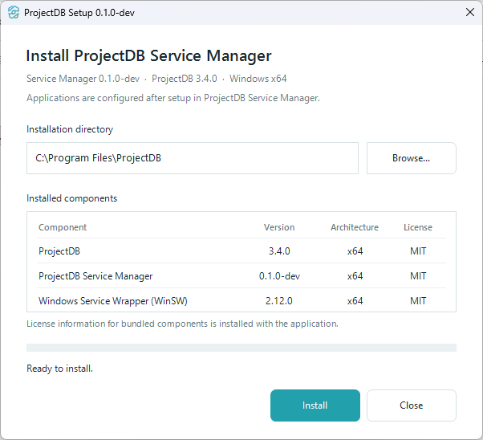
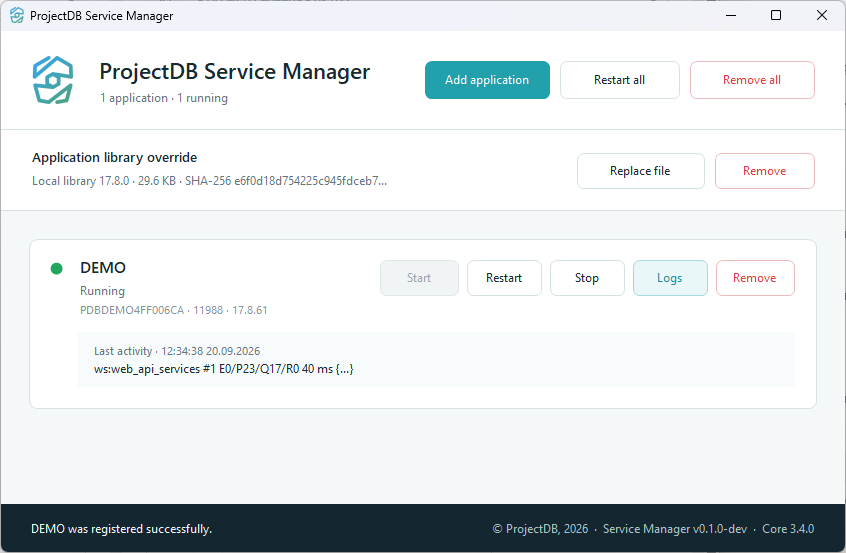

# ProjectDB Service Manager

Описание и руководство также доступны [на русском языке](README.ru.md).

**ProjectDB Service Manager** is a Windows desktop application for installing ProjectDB and managing one or more ProjectDB applications as Windows services.

It provides a single interface for registering applications, starting and stopping them, monitoring their status and recent activity, opening logs, updating ProjectDB and managing a local `app.so` override. Service configuration and day-to-day management are handled by the application.

ProjectDB is developed separately in its [GitHub repository](https://github.com/pavel-elblaus/projectdb). Learn more about the product at [projectdb.pro](https://projectdb.pro).

## Screenshots

### Setup

### ProjectDB Service Manager

## Why ProjectDB Service Manager?

- **One installation for multiple applications.** ProjectDB files are shared, while every registered application has its own configuration and Windows service.
- **Reliable background operation.** Applications can start automatically with Windows. If an application is stopped manually in Service Manager, it stays stopped after a reboot until it is started again.
- **Everything in one place.** Start, stop and restart applications, see their state and recent activity, and open their logs directly from the main window.
- **Safe updates.** Setup detects an existing installation, preserves registered applications and a local `app.so`, updates ProjectDB and Service Manager, and restores applications that were running before the update.
- **Convenient administration.** Applications can be added or removed independently, all running applications can be restarted together, and common actions are also available from the system tray.

## Download and installation

Download the latest **Windows x64** installer from [GitHub Releases](https://github.com/pavel-elblaus/projectdb-service-manager/releases/latest):

`ProjectDB-Setup-<version>.exe`

To install:

1. Run the downloaded Setup executable.
2. Approve the Windows administrator prompt.
3. Choose the installation directory. By default, ProjectDB is installed to `C:\Program Files\ProjectDB`.
4. Click **Install**.
5. After installation, ProjectDB Service Manager starts automatically.

Setup contains everything required for installation, so no additional downloads are needed during setup.

Application connection details are configured after installation in ProjectDB Service Manager.

## Add an application

Open **ProjectDB Service Manager** and click **Add application**.

Enter:

| Field | Description |
| --- | --- |
| **ProjectDB server address** | Configuration server used by the application. The default is `node.projectdb.pro`. |
| **Application name** | ProjectDB application identifier, for example `DEMO`. |
| **Access password** | Password used to obtain the application's ProjectDB configuration. |

Click **Register**.

The application is registered as a separate Windows service and appears in the main Service Manager window. The installed ProjectDB files are shared between all registered applications.

## Manage applications

Each registered application is displayed as a separate card.

| Action | Description |
| --- | --- |
| **Start** | Starts the application and enables automatic startup after a Windows reboot. |
| **Restart** | Restarts a running application without changing its automatic-start state. |
| **Stop** | Stops the application and keeps it stopped after a Windows reboot. |
| **Logs** | Opens the application's log directory. |
| **Remove** | Removes this application, its service configuration and service logs. The shared ProjectDB installation and other applications remain installed. |

The top toolbar also provides:

- **Add application** — register another ProjectDB application;
- **Restart all** — restart all currently running applications;
- **Remove all** — remove all registered applications while keeping ProjectDB Service Manager and the shared ProjectDB installation.

## Status and recent activity

The application card shows the current state with a color indicator:

- green — running and initialized;
- yellow — starting, stopping or waiting for initialization;
- red — stopped;
- gray — unavailable or unknown.

For a running application, the card can also show its process ID and ProjectDB source/version information.

The **Last activity** area displays the latest structured log message. Warnings and errors are highlighted so problems are easier to notice.

## Manage `app.so`

The **ProjectDB library** section lets you select a local `app.so` file.

A selected local library takes priority over the normal ProjectDB library selection and is preserved when ProjectDB is updated.

Use **Remove** in the library section to remove the local override and return to the standard ProjectDB library selection.

## Updating

Download a newer Setup executable and run it normally.

If ProjectDB Service Manager is already installed, Setup automatically switches to **Update** mode. It preserves registered applications and a local `app.so`, updates the installed components, and starts again the applications that were running before the update.

Applications do not need to be removed or registered again after a normal update.

## Removing applications and uninstalling

**Remove** on an application card removes only that application. Other registered applications and the shared ProjectDB installation remain available.

**Remove all** removes all registered applications but keeps ProjectDB Service Manager and ProjectDB installed.

To remove the complete installation, use **Uninstall ProjectDB** from the Service Manager tray menu or the standard Windows installed-apps interface.

## Administrator rights

Administrator privileges are required for installation, updates, application registration/removal and complete uninstallation.

Normal application control from the main window — including Start, Stop and Restart — does not require a separate administrator prompt each time.

## License

ProjectDB Service Manager is distributed under the [MIT License](LICENSE).

The installer also includes separate software projects that retain their own licenses and copyright notices:

- [ProjectDB](https://github.com/pavel-elblaus/projectdb) — MIT License;
- [Windows Service Wrapper (WinSW)](https://github.com/winsw/winsw) — MIT License.

License and copyright notices for bundled software are included in [THIRD-PARTY-NOTICES.txt](THIRD-PARTY-NOTICES.txt).
