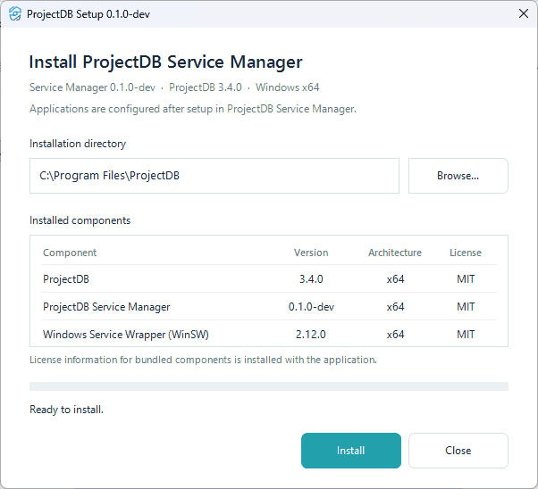

# ProjectDB Service Manager

This description and guide are also available [in English](README.md).

**ProjectDB Service Manager** — настольное приложение для Windows, предназначенное для установки ProjectDB и управления одним или несколькими приложениями ProjectDB как службами Windows.

В одном интерфейсе можно регистрировать приложения, запускать и останавливать их, следить за состоянием и последними событиями, открывать логи, обновлять ProjectDB и управлять локальной библиотекой `app.so`. Настройку служб и повседневное управление программа выполняет самостоятельно.

Разработка ProjectDB ведётся отдельно в [репозитории на GitHub](https://github.com/pavel-elblaus/projectdb). Подробнее о продукте — на сайте [projectdb.ru](https://projectdb.ru).

## Скриншоты

### Установщик

	

### ProjectDB Service Manager

	

## Зачем нужен ProjectDB Service Manager

- **Одна установка для нескольких приложений.** Файлы ProjectDB используются совместно, а каждое зарегистрированное приложение имеет собственную конфигурацию и службу Windows.
- **Надёжная фоновая работа.** Приложения могут автоматически запускаться вместе с Windows. Если приложение вручную остановлено в Service Manager, после перезагрузки оно останется остановленным до следующего запуска пользователем.
- **Всё управление в одном окне.** Запуск, остановка и перезапуск приложений, просмотр состояния и последних событий, а также быстрый доступ к логам.
- **Безопасное обновление.** Setup определяет существующую установку, сохраняет зарегистрированные приложения и локальный `app.so`, обновляет ProjectDB и Service Manager и повторно запускает приложения, которые работали до обновления.
- **Удобное администрирование.** Приложения можно независимо добавлять и удалять, все работающие приложения можно перезапустить одной кнопкой, а основные действия доступны также из системного трея.

## Скачивание и установка

Скачайте последнюю версию для **Windows x64** в [GitHub Releases](https://github.com/pavel-elblaus/projectdb-service-manager/releases/latest):

`ProjectDB-Setup-<version>.exe`

Для установки:

1. Запустите скачанный Setup.
2. Подтвердите запрос прав администратора Windows.
3. Выберите каталог установки. По умолчанию ProjectDB устанавливается в `C:\Program Files\ProjectDB`.
4. Нажмите **Install**.
5. После завершения установки ProjectDB Service Manager запустится автоматически.

Setup содержит всё необходимое для установки, поэтому во время установки дополнительные загрузки не требуются.

Данные подключения конкретного приложения настраиваются уже после установки в ProjectDB Service Manager.

## Добавление приложения

Откройте **ProjectDB Service Manager** и нажмите **Add application**.

Заполните:

| Поле | Назначение |
| --- | --- |
| **ProjectDB server address** | Сервер конфигурации приложения. По умолчанию используется `node.projectdb.pro`. |
| **Application name** | Идентификатор приложения ProjectDB, например `DEMO`. |
| **Access password** | Пароль для получения конфигурации приложения ProjectDB. |

Нажмите **Register**.

Приложение будет зарегистрировано как отдельная служба Windows и появится в основном окне Service Manager. Установленные файлы ProjectDB используются совместно всеми зарегистрированными приложениями.

## Управление приложениями

Каждое зарегистрированное приложение отображается отдельной карточкой.

| Действие | Назначение |
| --- | --- |
| **Start** | Запускает приложение и включает его автоматический запуск после перезагрузки Windows. |
| **Restart** | Перезапускает работающее приложение, не изменяя настройку автоматического запуска. |
| **Stop** | Останавливает приложение и сохраняет это состояние после перезагрузки Windows. |
| **Logs** | Открывает каталог логов приложения. |
| **Remove** | Удаляет это приложение, конфигурацию его службы и служебные логи. Общая установка ProjectDB и другие приложения сохраняются. |

В верхней панели доступны:

- **Add application** — зарегистрировать ещё одно приложение ProjectDB;
- **Restart all** — перезапустить все работающие приложения;
- **Remove all** — удалить все зарегистрированные приложения, сохранив ProjectDB Service Manager и общую установку ProjectDB.

## Статус и последние события

Карточка приложения показывает текущее состояние цветным индикатором:

- зелёный — приложение работает и инициализировано;
- жёлтый — запуск, остановка или ожидание инициализации;
- красный — остановлено;
- серый — состояние недоступно или неизвестно.

Для работающего приложения также могут отображаться PID процесса и сведения об источнике/версии ProjectDB.

В блоке **Last activity** отображается последняя структурированная запись лога. Предупреждения и ошибки выделяются, чтобы проблему было проще заметить.

## Управление `app.so`

Раздел **ProjectDB library** позволяет выбрать локальный файл `app.so`.

Выбранная локальная библиотека имеет приоритет над обычным механизмом выбора библиотеки ProjectDB и сохраняется при обновлении ProjectDB.

Кнопка **Remove** в разделе библиотеки удаляет локальное переопределение и возвращает стандартный механизм выбора библиотеки ProjectDB.

## Обновление

Скачайте новый Setup и запустите его обычным способом.

Если ProjectDB Service Manager уже установлен, Setup автоматически переключится в режим **Update**. Он сохранит зарегистрированные приложения и локальный `app.so`, обновит установленные компоненты и повторно запустит приложения, которые работали до обновления.

После обычного обновления удалять и заново регистрировать приложения не требуется.

## Удаление приложений и полная деинсталляция

**Remove** в карточке приложения удаляет только это приложение. Остальные зарегистрированные приложения и общая установка ProjectDB сохраняются.

**Remove all** удаляет все зарегистрированные приложения, но оставляет ProjectDB Service Manager и ProjectDB установленными.

Чтобы удалить всю установку, используйте **Uninstall ProjectDB** в меню Service Manager в системном трее или стандартный раздел установленных приложений Windows.

## Права администратора

Права администратора требуются для установки, обновления, регистрации/удаления приложений и полной деинсталляции.

Обычное управление приложениями из главного окна — в том числе Start, Stop и Restart — не требует отдельного запроса прав администратора при каждом действии.

## Лицензия

ProjectDB Service Manager распространяется по [лицензии MIT](LICENSE).

В установщик также входят отдельные программные проекты, которые сохраняют собственные лицензии и copyright-уведомления:

- [ProjectDB](https://github.com/pavel-elblaus/projectdb) — MIT License;
- [Windows Service Wrapper (WinSW)](https://github.com/winsw/winsw) — MIT License.

Лицензионные и copyright-уведомления для включённого программного обеспечения находятся в [THIRD-PARTY-NOTICES.txt](THIRD-PARTY-NOTICES.txt).
